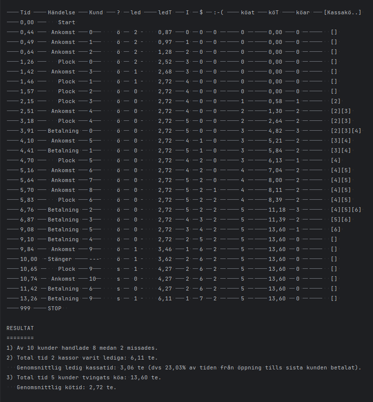

<h1>Supermarket Simulation Project</h1>
    
This Java project simulates a supermarket environment to optimize the number of checkouts for efficient customer service.

    
The simulation employs various algorithms and strategies to dynamically adjust the number of open checkouts based on factors such as customer arrival rates, queue lengths, and checkout processing times.

    
Through this project, supermarket managers and operators can explore different scenarios and strategies to improve customer satisfaction and operational efficiency.

